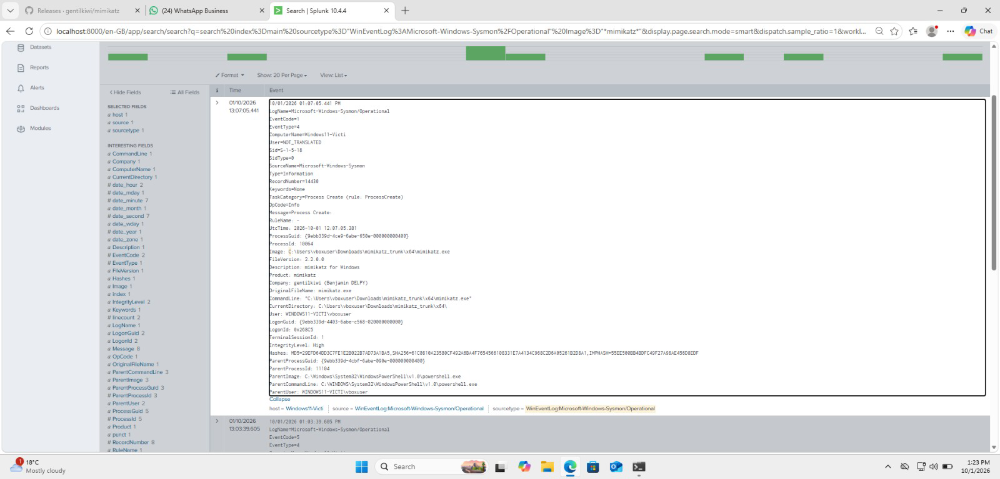
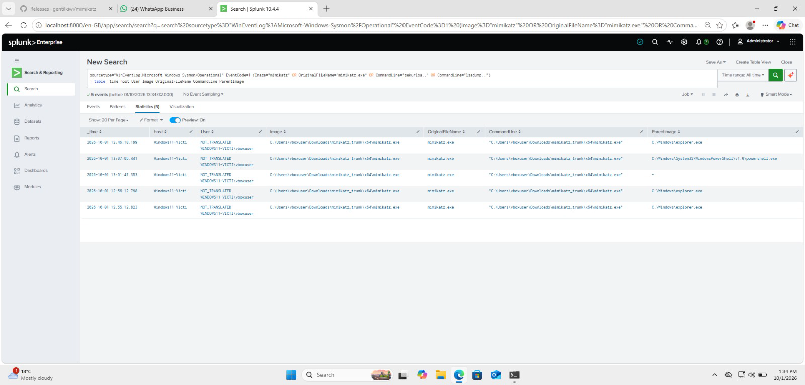
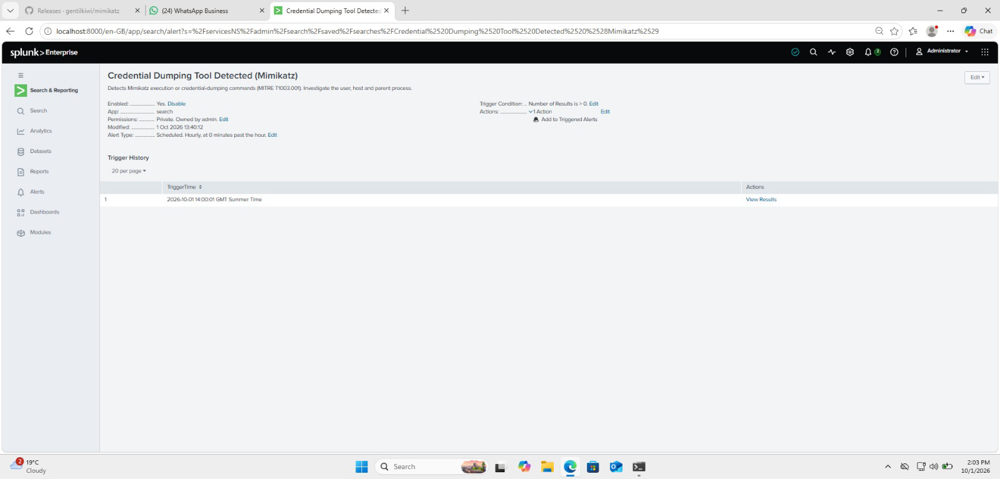
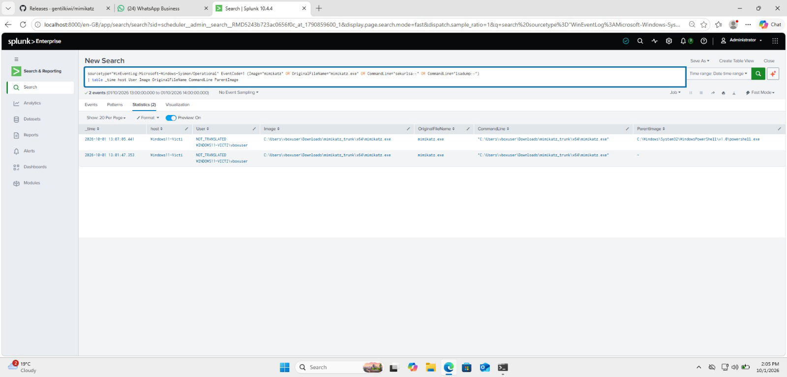

# Home SOC Lab

A home lab for practising detection engineering with Splunk and Sysmon.

## Setup
- Windows 11 victim VM (VirtualBox)
- Sysmon logging process activity
- Splunk Enterprise indexing Sysmon events

## Detection 1: Mimikatz Credential Dumping (MITRE T1003.001)

**Attack:** Ran Mimikatz (`sekurlsa::logonpasswords`) on the victim VM. LSASS Protected Process blocked the dump, but the tool's execution was still logged.
Attack tool: Mimikatz (github.com/gentilkiwi/mimikatz)

**Detection logic:** Sysmon Event ID 1 (process creation) matching the Mimikatz file name, original file name, or credential-dumping commands. Using `OriginalFileName` catches renamed binaries.

**Alert settings:** Scheduled hourly over the last 60 minutes, triggers when results > 0, throttled for 1 hour, severity High.

**Result:** The alert fired at its next scheduled run and captured both Mimikatz executions with user, host, file path and parent process.

## Evidence

See `detections/` for the SPL.
